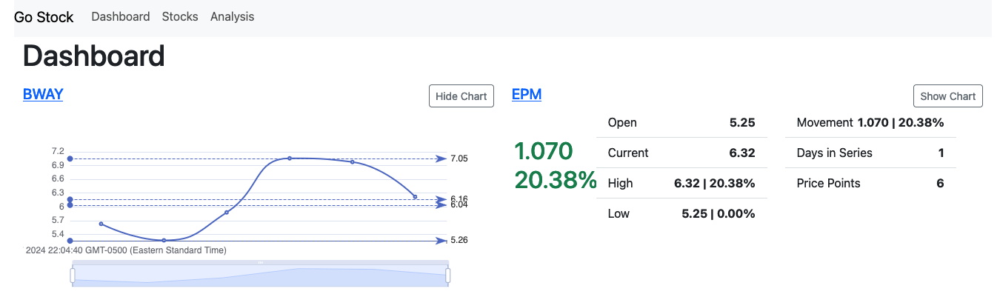
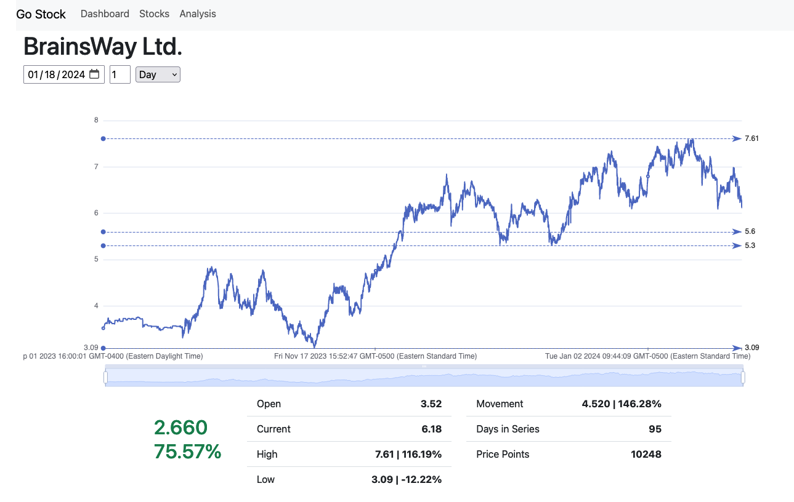

# go-stock-frontend

## Description

go-stock is a simple app for streaming real-time stock data and performing basic time-series analysis. The goal is to leverage the power of FinnHub.io's [free stock API](https://finnhub.io/) to provide a simple, easy to use streaming stock dashboard. This application is a personal project and is designed solely for my use. The application utilizes Go on the backend and TypeScript React on the frontend.

The front end is a work in progress. It currently has two functional views: Dashboard and Analysis. There are known issues with properly calculating some of the metrics, including the High and Low prices, along with price movement. The last close price is not currently being captured properly, which makes calculations such as intraday performance incorrect. This is due to the fact that the open price can and often is different from the last close price. This issue is being addressed in an extensive refactor that involves the backend and the frontend. 

As part of the refactor, the calculation of these metrics will be shifted to the backend. 

## Dashboard

The Dashboard features a two-column tile layout with one pane per stock. Each series component includes a widget showing key metrics that are common to stock dashboards. A button on the top right toggles the chart component. Both display options respond to streaming data, sent over a web socket connection.

## Analysis

The Analysis view allows basic charting and analysis of stock time series data. The same component from the dashboard is re-used to show metrics for the time series. The chart is much larger.

