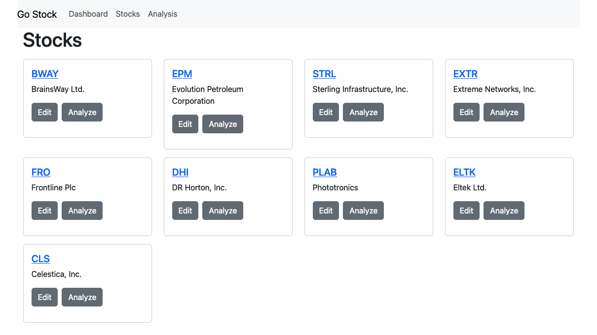

# go-stock-frontend

## Description

go-stock is a simple app for streaming real-time stock data and performing basic time-series analysis. The goal is to leverage the power of FinnHub.io's [free stock API](https://finnhub.io/) to provide a simple, easy to use streaming stock dashboard. This application is a personal project and is designed solely for my use. The application utilizes Go on the backend and TypeScript React on the frontend.

The front end is a work in progress. It currently has three functional views: Dashboard, Stocks, and Analysis. 

## Note about metrics

There are known issues with properly calculating some of the metrics, including the High and Low prices, along with price movement. There are a few causes:

1. The last close price is not currently being captured properly, which makes calculations such as intraday performance incorrect. 
2. The High and Low prices are not correct, because we are polling for price updates. Because we are polling for live updates, as opposed to receiving every price update, we will inherently miss data points. 

The above are consequences of attempting to adapt FinnHub's free API tier into a more useful tool, other than just streaming data to a frontend. For me, it represents a fun challenge. In this first iteration, the calculation of these metrics is being performed on the frontend with only the intraday price data. 

Without a correct last close price, and without filling in the gaps in the data (which we can do creatively), the numbers will be slightly off. There is a refactor underway to address all of these issues.

## Dashboard

The Dashboard features a tile layout with one pane per stock. Each series component includes a widget showing key metrics that are common to stock dashboards. A button on the top right toggles the chart component. Both display options respond to streaming data, sent over a web socket connection.

## Stocks

The Stocks view shows a tile display of all stocks in the database. There are Edit and Analyze buttons for each stock. The Edit view is currently in development. The Analyze button will take you to the next section, Analysis. 

## Analysis

The Analysis view allows basic charting and analysis of stock time series data. The same component from the dashboard is re-used to show metrics for the time series. The chart is much larger.

## Development

There is a lot of work to be done on the frontend. A partial list follows.

1. The highest priority is refactoring all components to simply receive and report the Last Close, Open, High, and Low prices. Calculations of intraday performance will be made easier by this change. 
2. Add a Create stock page and build out the Edit stock page
3. Add more Dashboard components and functionality
4. Provide a header displaying streaming updates to major indexes (S&P500, etc.)
